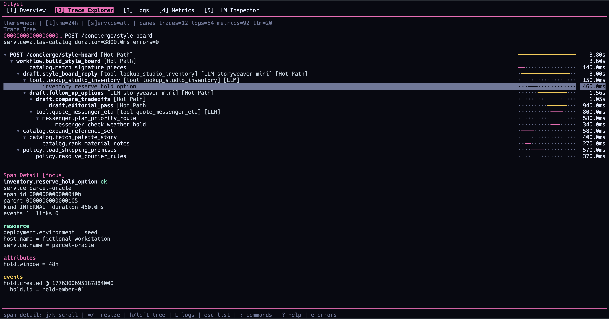
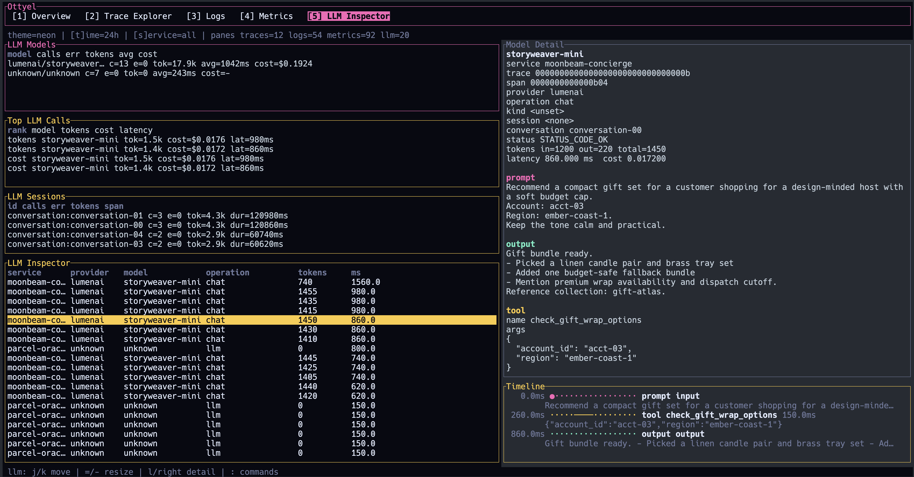

# ottyel

`ottyel` is a local OpenTelemetry workstation for the terminal.

It accepts OTLP over HTTP and gRPC, stores traces, logs, metrics, and LLM
telemetry in SQLite, and gives you a fast keyboard-first interface (mouse navigation is supported also) for
investigating systems without shipping data to a hosted backend.

It is built for two jobs:

- inspect ordinary distributed traces, logs, and metrics locally
- inspect LLM-heavy workflows with prompt/output views, model rollups, sessions,
  timelines, and token or cost summaries

## Why

Most local observability setups are either too thin to be useful or too tied to
remote infrastructure. `ottyel` is meant to be a serious local workstation:

- OTLP/HTTP and OTLP/gRPC ingest on the standard local ports
- trace exploration with tree navigation, timing bars, and hot-path highlighting
- logs, metrics, and LLM views in the same terminal app
- local-first workflow for debugging apps, agents, eval runs, and prompt loops

## Screenshots

<table>
  <tr>
    <td width="50%" valign="top">
      
      <p><strong>LLM Inspector</strong><br />Model rollups, top calls, session summaries, and prompt and output inspection in one view.</p>
    </td>
    <td width="50%" valign="top">
      
      <p><strong>Trace Explorer</strong><br />Deep trace trees with waterfall timing, hot-path highlighting, and span-level drilldown.</p>
    </td>
  </tr>
</table>

## Install

From the repo:

```bash
cargo install --locked --path .
```

The binary is installed into Cargo's bin directory, typically
`~/.cargo/bin`.

## Quick Start

Start the app:

```bash
ottyel serve
```

Default listeners:

- OTLP/HTTP protobuf: `127.0.0.1:4318`
- OTLP/gRPC: `127.0.0.1:4317`

Default database location:

- macOS: `~/Library/Application Support/ottyel/ottyel.db`
- Linux: `$XDG_DATA_HOME/ottyel/ottyel.db` or `~/.local/share/ottyel/ottyel.db`
- Windows: `%APPDATA%\ottyel\ottyel.db`

Point an OpenTelemetry SDK at it with OTLP/HTTP:

```bash
export OTEL_EXPORTER_OTLP_PROTOCOL=http/protobuf
export OTEL_EXPORTER_OTLP_ENDPOINT=http://127.0.0.1:4318
```

Or with OTLP/gRPC:

```bash
export OTEL_EXPORTER_OTLP_PROTOCOL=grpc
export OTEL_EXPORTER_OTLP_ENDPOINT=http://127.0.0.1:4317
```

## Current Capabilities

- trace list and trace drilldown
- expandable trace tree with waterfall timing bars
- hot-path highlighting
- span detail with attributes, events, links, and LLM fields
- logs feed with filters and detail inspection
- metrics feed with charting and detail views
- LLM inspector with rollups, sessions, model comparison, prompt and output
  views, and timelines
- span-to-logs pivot from the trace explorer
- command palette, help overlays, mouse support, and layout presets

## Notes

- `ottyel` is local-first. It is not a hosted collector or multi-user service.
- SQLite is the source of truth for the local dataset.
- Raw attributes remain visible even when higher-level LLM normalization is
  available.

## License

MIT
