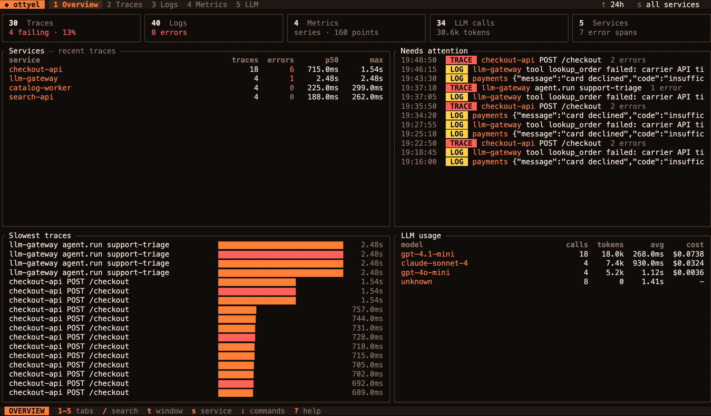
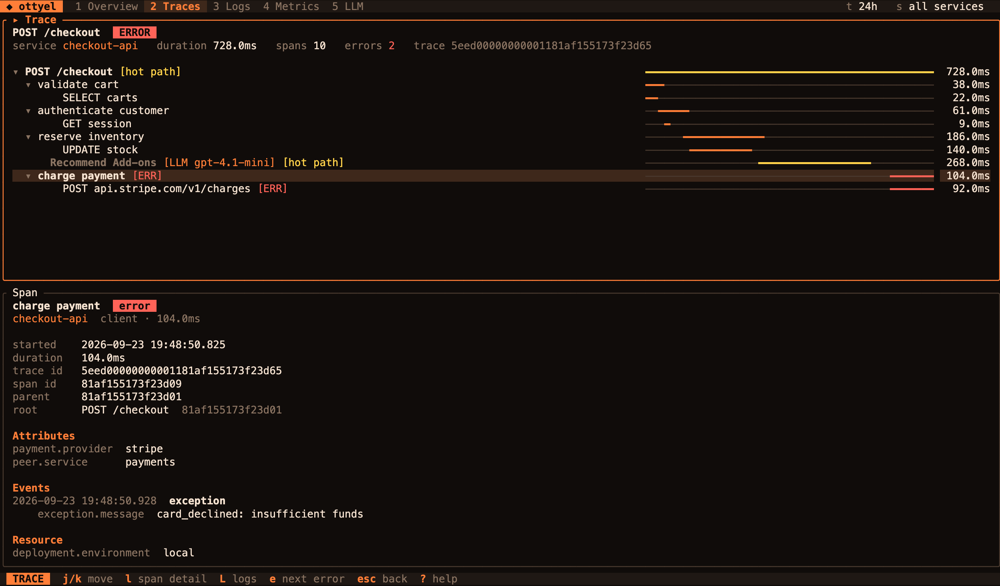
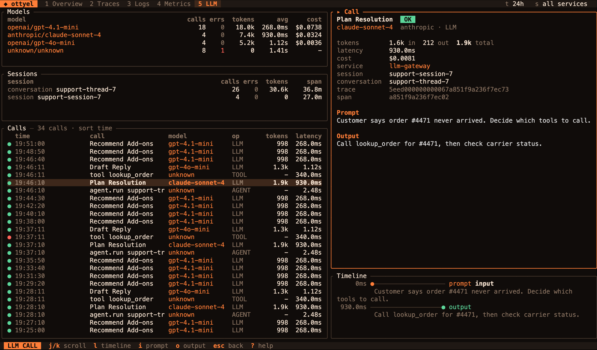
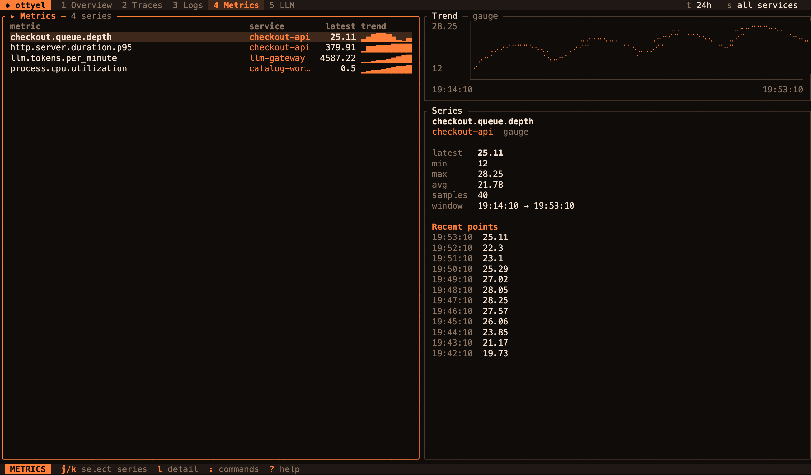
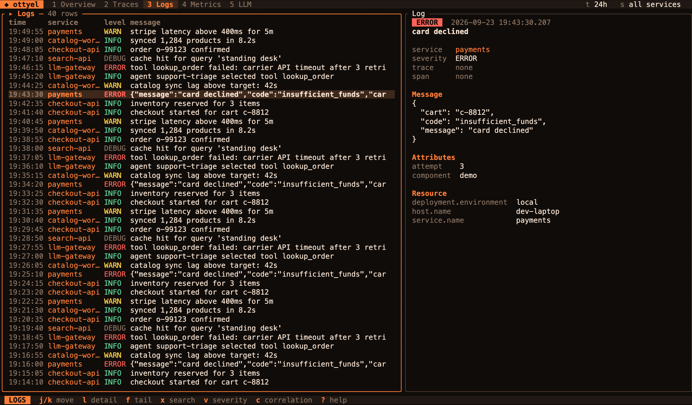

# ottyel

`ottyel` is a local OpenTelemetry workstation for the terminal.

It accepts OTLP over HTTP and gRPC, stores traces, logs, metrics, and LLM
telemetry in SQLite, and gives you a fast keyboard-first interface with mouse
support for investigating systems without shipping data to a hosted backend.

It is built for two jobs:

- inspect ordinary distributed traces, logs, and metrics locally
- inspect LLM-heavy workflows with prompt/output views, model rollups, sessions,
  timelines, and token or cost summaries

## Quick Start
1. Clone the repo
1. build with `cargo install --locked --path .`
1. run `ottyel`

That’s it. It will run both the TUI and the server to ingest telemetry.

## Why

Most local observability setups are either too thin to be useful or too tied to
remote infrastructure. `ottyel` is meant to be a serious local workstation:

- OTLP/HTTP and OTLP/gRPC ingest on the standard local ports
- trace exploration with tree navigation, timing bars, and hot-path highlighting
- logs, metrics, and LLM views in the same terminal app
- local-first workflow for debugging apps, agents, eval runs, and prompt loops

## Screenshots

<p>
  
  <br /><strong>Overview</strong>: what is arriving, what is failing, and what is slow, at a glance.
</p>

<table>
  <tr>
    <td width="50%" valign="top">
      
      <p><strong>Trace Explorer</strong><br />Nested trace trees with waterfall timing, hot-path and error highlighting, and full span detail.</p>
    </td>
    <td width="50%" valign="top">
      
      <p><strong>LLM Inspector</strong><br />Model and session rollups, every call with tokens and latency, and prompt and output inspection.</p>
    </td>
  </tr>
  <tr>
    <td width="50%" valign="top">
      
      <p><strong>Metrics</strong><br />Series with inline sparklines, a trend chart, and min, max, and average for the selection.</p>
    </td>
    <td width="50%" valign="top">
      
      <p><strong>Logs</strong><br />Severity-colored feed with trace correlation and structured, pretty-printed detail.</p>
    </td>
  </tr>
</table>

Screenshots are rendered from a demo workload by `scripts/readme-screenshots.sh`.

## Install

From the repo:

```bash
cargo install --locked --path .
```

The binary is installed into Cargo's bin directory, typically
`~/.cargo/bin`.

## Quick Start

Start the app:

```bash
ottyel
```

Default listeners:

- OTLP/HTTP protobuf: `127.0.0.1:4318`
- OTLP/gRPC: `127.0.0.1:4317`

Default database location:

- macOS: `~/Library/Application Support/ottyel/ottyel.db`
- Linux: `$XDG_DATA_HOME/ottyel/ottyel.db` or `~/.local/share/ottyel/ottyel.db`
- Windows: `%APPDATA%\ottyel\ottyel.db`

Point an OpenTelemetry SDK at it with OTLP/HTTP:

```bash
export OTEL_EXPORTER_OTLP_PROTOCOL=http/protobuf
export OTEL_EXPORTER_OTLP_ENDPOINT=http://127.0.0.1:4318
```

Or with OTLP/gRPC:

```bash
export OTEL_EXPORTER_OTLP_PROTOCOL=grpc
export OTEL_EXPORTER_OTLP_ENDPOINT=http://127.0.0.1:4317
```

## MCP

`ottyel` can expose the local SQLite dataset over MCP for agents and other
tools. The MCP server is read-only.

```bash
ottyel mcp
```

Example client config:

```json
{
  "mcpServers": {
    "ottyel": {
      "command": "ottyel",
      "args": ["mcp"]
    }
  }
}
```

Use a specific database:

```json
{
  "mcpServers": {
    "ottyel": {
      "command": "ottyel",
      "args": ["mcp", "--db-path", "/path/to/ottyel.db"]
    }
  }
}
```

Resources:

- `ottyel://overview`
- `ottyel://traces/recent`
- `ottyel://logs/recent`
- `ottyel://metrics/recent`
- `ottyel://llm/recent`
- `ottyel://llm/rollups`

Resource templates:

- `ottyel://trace/{trace_id}`
- `ottyel://logs/{trace_id}`
- `ottyel://llm/{trace_id}/{span_id}/timeline`

Tools:

- `search_traces`
- `get_trace`
- `search_logs`
- `search_metrics`
- `search_llm`
- `get_llm_timeline`

## Current Capabilities

- trace list and trace drilldown
- expandable trace tree with waterfall timing bars
- hot-path highlighting
- span detail with attributes, events, links, and LLM fields
- logs feed with filters and detail inspection
- metrics feed with charting and detail views
- LLM inspector with rollups, sessions, model comparison, prompt and output
  views, and timelines
- span-to-logs pivot from the trace explorer
- command palette, help overlays, mouse support, and layout presets

## Notes

- `ottyel` is local-first. It is not a hosted collector or multi-user service.
- SQLite is the source of truth for the local dataset.
- Raw attributes remain visible even when higher-level LLM normalization is
  available.

## License

MIT
